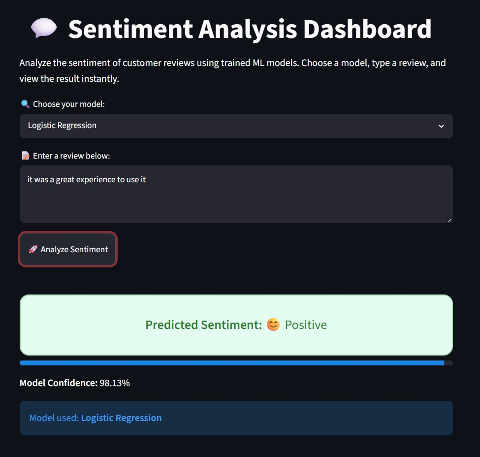
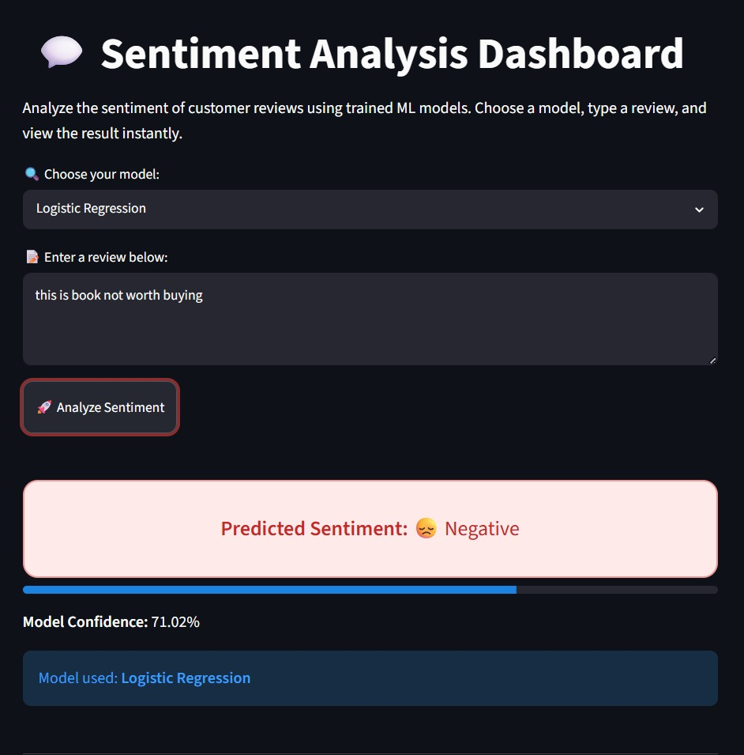

# Multi-Domain Product Review Sentiment Analysis

> A binary sentiment classifier for product reviews spanning **24 domains**, built as a classical-ML baseline. Compares Logistic Regression, Linear SVM, and Random Forest over TF-IDF features with 8-fold cross-validation. Best model (Logistic Regression) reaches **85.72% accuracy / 0.8770 F1** under leakage-free cross-validation, with all results reported transparently including their limitations.

[](https://www.python.org/)
[](https://scikit-learn.org/)
[](https://streamlit.io/)
[](LICENSE)

---

## TL;DR

| | |
|---|---|
| **Task** | Binary sentiment classification (positive / negative) |
| **Dataset** | 38,547 product reviews across 24 domains |
| **Features** | TF-IDF (5,000 features, unigrams + bigrams) |
| **Models compared** | Logistic Regression, Linear SVM, Random Forest |
| **Validation** | 8-fold cross-validation |
| **Best model** | Logistic Regression — **85.72% accuracy, 0.8770 F1** |
| **Validation integrity** | Leakage-free (TF-IDF fit per-fold via `Pipeline`) |
| **Interface** | Streamlit app with live model selection + confidence |

This is a deliberately scoped **classical-ML baseline** — no deep learning. The goal was a clean, honestly-evaluated comparison of standard text-classification models across many product categories.

---

## Overview

The project takes raw product-review text and predicts whether the review expresses **positive** or **negative** sentiment. Three classical models are trained on the same TF-IDF representation and compared under identical cross-validation, so the comparison is apples-to-apples. A Streamlit app lets a user pick any of the three trained models, paste a review, and see the predicted sentiment with a confidence score.

---

## Dataset

`aggregated_reviews.csv` — 38,547 labelled reviews aggregated across 24 product domains.

| Column | Description |
|--------|-------------|
| `domain` | Product category (e.g. apparel, books, electronics) |
| `review_text` | Raw review text |
| `label` | `positive` or `negative` |
| `label_encoded` | `1` (positive) / `0` (negative) |

**Class balance:** 21,972 positive (57%) / 16,575 negative (43%) — mildly imbalanced.

**Domain spread (24 categories):** apparel, books, dvd, electronics, health & personal care, kitchen & housewares, music, toys & games, video, camera & photo, sports & outdoors, magazines, software, baby, beauty, computer & video games, grocery, outdoor living, jewelry & watches, gourmet food, cell phones & service, automotive, office products, musical instruments, tools & hardware. Most domains contribute ~2,000 reviews; the long tail (e.g. tools & hardware) has far fewer.

### Data source & citation

This is a binary-labelled aggregation of the **Multi-Domain Sentiment Dataset (v2.0)** — Amazon product reviews across ~25 domains, with roughly 2,000 labelled reviews per domain. The original per-domain positive/negative review files have been combined into a single CSV (`domain`, `review_text`, `label`, `label_encoded`) and redistributed publicly via mirrors (e.g. Kaggle / Hugging Face).

**Original source:** [cs.jhu.edu/~mdredze/datasets/sentiment](https://www.cs.jhu.edu/~mdredze/datasets/sentiment/)

If you use this data, cite the original paper:

> John Blitzer, Mark Dredze, and Fernando Pereira. *Biographies, Bollywood, Boom-boxes and Blenders: Domain Adaptation for Sentiment Classification.* Proceedings of the Association for Computational Linguistics (ACL), 2007.

---

## Methodology

### Text preprocessing
Each review is cleaned with a single function:
- Strip HTML tags and URLs.
- Remove non-alphabetic characters and digits.
- Collapse repeated whitespace and lowercase.

### Feature extraction
- **TF-IDF** with `max_features=5000`, `ngram_range=(1, 2)` (unigrams + bigrams), English stop-word removal.

### Models compared
| Model | Key settings |
|-------|--------------|
| Logistic Regression | `max_iter=200` |
| Linear SVM | `LinearSVC` (default) |
| Random Forest | `n_estimators=200` |

### Evaluation
- **8-fold cross-validation** (`KFold`, shuffled, `random_state=42`).
- **Leakage-free by design:** TF-IDF and the classifier are wrapped in a single scikit-learn `Pipeline`, so the vectorizer's vocabulary and IDF weights are fit on each training fold only — never on the held-out fold. This avoids the common mistake of fitting TF-IDF on the full dataset before cross-validation.
- Reported metrics: **accuracy** and **F1** (mean ± standard deviation across folds).

---

## Results

8-fold cross-validation, sorted by F1:

| Model | Accuracy | F1 |
|-------|----------|-----|
| **Logistic Regression** | **0.8572 ± 0.0041** | **0.8770 ± 0.0041** |
| Linear SVM | 0.8516 ± 0.0033 | 0.8709 ± 0.0032 |
| Random Forest | 0.8483 ± 0.0058 | 0.8695 ± 0.0046 |

**Takeaways:**
- All three models land in a tight band (~85% accuracy), which is the expected ceiling for TF-IDF + linear/tree models on multi-domain review sentiment.
- **Logistic Regression wins** on both metrics while being the smallest and fastest model — a clean illustration of "simplest adequate model" beating heavier alternatives here.
- The low fold-to-fold standard deviation (~0.003–0.006) indicates stable, reproducible performance rather than a lucky split.
- Because the vectorizer is fit per-fold, these numbers are **leakage-free** — they reflect performance on text whose vocabulary statistics the model did not see during training.

---

## Interactive App

`app.py` is a Streamlit dashboard that:
- Lets the user choose between the three trained models.
- Accepts free-text review input.
- Returns the predicted sentiment and a confidence score (with a graceful fallback for Linear SVM, which has no native probability output).

> **Note:** This project is intentionally **not deployed as a hosted live demo**. Run it locally (instructions below). The Streamlit app is included so the trained models are usable end-to-end.

### Demo





---

## Limitations & Honest Notes

1. **Classical-ML ceiling.** TF-IDF discards word order beyond bigrams and has no semantic understanding. A transformer baseline (e.g. a fine-tuned DistilBERT) would be the natural next step and would likely close the gap on harder, sarcasm-heavy reviews.

2. **Mild class imbalance** (57/43) is handled implicitly rather than with explicit class weighting or resampling.

3. **No per-domain breakdown.** Performance is reported in aggregate; some domains (e.g. the small `tools & hardware` set) likely perform worse and aren't separately measured.

---

## What I'd Do Next

- Add a fine-tuned transformer baseline (DistilBERT) for comparison.
- Report per-domain accuracy to surface where the model is weakest.
- Add a proper held-out test set for the final deployed models.

---

## Repository Structure

```
reviewSentimentAnalyzer/
├── README.md            Project overview (this file)
├── LICENSE              MIT license
├── requirements.txt     Python dependencies
├── .gitignore           Excludes data + model weights
├── app.py               Streamlit demo application
├── model.ipynb          End-to-end notebook (clean → TF-IDF → train → CV → save)
└── screenshots/         App demo screenshots used in this README
```

> **Not committed** (regenerated by running the notebook): the dataset CSV and the trained `.pkl` model/vectorizer files. The Random Forest model in particular exceeds GitHub's 100 MB per-file limit, so model artifacts are intentionally excluded.

---

## How to Run Locally

### 1. Clone the repository
```bash
git clone https://github.com/Tanishqarya17/reviewSentimentAnalyzer.git
cd reviewSentimentAnalyzer
```
_(Adjust the URL to match your exact repo name/casing.)_

### 2. Install dependencies
```bash
pip install -r requirements.txt
```

### 3. Regenerate the models
Place `aggregated_reviews.csv` in the project root, then open and run `model.ipynb` top to bottom. This cleans the data, builds the TF-IDF features, trains all three models, runs cross-validation, and saves the model + vectorizer `.pkl` files.

### 4. Launch the app
```bash
streamlit run app.py
```

---

## Tech Stack

Python · scikit-learn · pandas · NumPy · Streamlit · joblib

---

## Contact

**Tanishq Arya**
- GitHub: [@Tanishqarya17](https://github.com/Tanishqarya17)
- Email: [tanishqarya789@gmail.com](mailto:tanishqarya789@gmail.com)
- LinkedIn: [@TanishqArya](https://www.linkedin.com/in/tanishq-arya-b10598292/)

---

## License

MIT License. See [LICENSE](LICENSE) for details.
